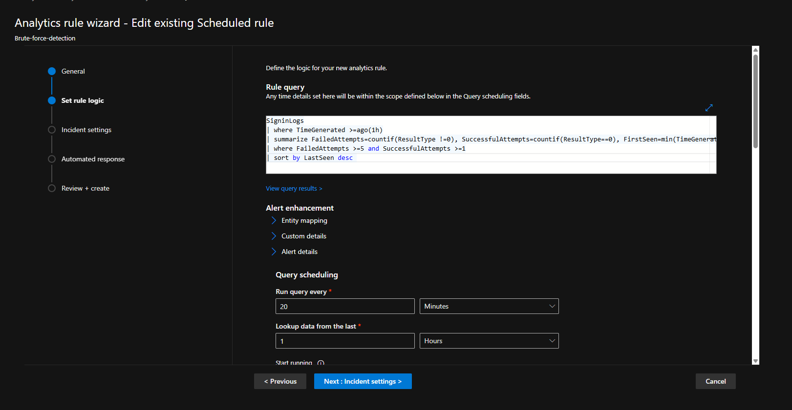
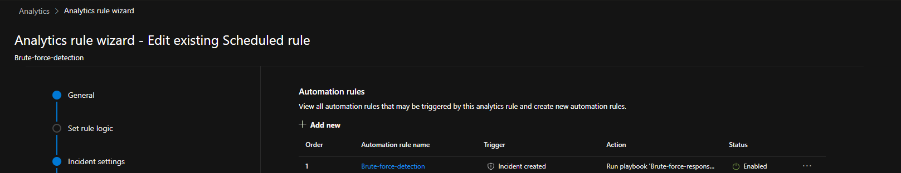
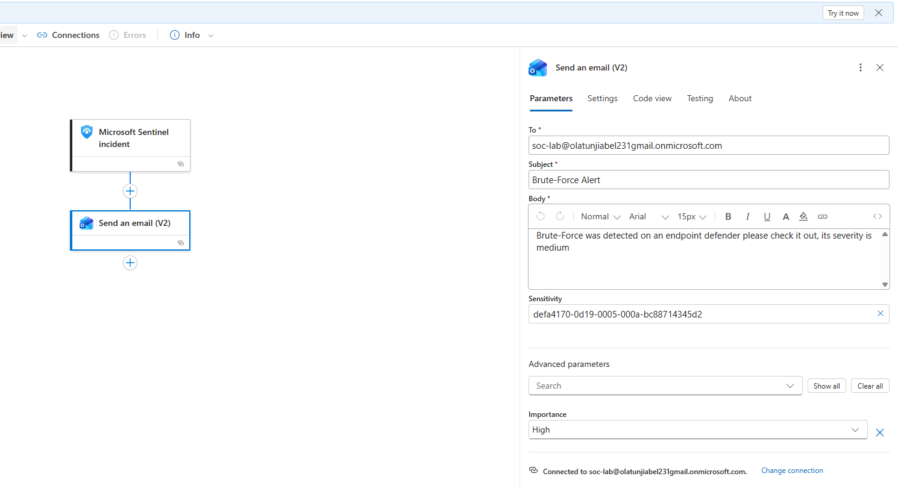

# 🛡️ Microsoft Sentinel SOAR Project — Brute Force Detection

## Project Overview

This project sole aim is to showcase the step-by-step process of generating an automated response to alerts or incidents in Microsoft Sentinel.

SOAR (Security Orchestration and Automated Remediation) refers to the activities that are put in place to automatically respond to alerts or incidents in a SOC.

---

## Prerequisites

- Microsoft Azure Subscription
- Microsoft Sentinel Workspace deployed
- Microsoft 365 Business Standard or E5 License (required for Logic App Outlook connector)
- Microsoft Defender for Office 365
- Log Analytics Workspace with SigninLogs enabled
- Role Assignment: **Sentinel Automation Contributor** assigned to **Azure Security Insights** via IAM

---

## Technologies Used

- **Microsoft Sentinel**
- **KQL** (Kusto Query Language)
- **Analytic Rule**
- **Automation Rule**
- **Logic App / Playbook**
- **Defender for Office 365 / Office 365 E5 License**
- **Role Assignment via IAM** — Sentinel Automation Contributor assigned to Azure Security Insights

---

## MITRE ATT&CK Mapping

| Tactic | Technique | ID |
|---|---|---|
| Credential Access | Brute Force | T1110 |

---

## What I Built

### 1. Analytic Rule — Brute-force-detection

I created an Analytics rule to trigger when multiple failed attempts occur on my Microsoft account (Brute-force-detection).

The Analytics rule generates incidents from the alert.


**KQL Query Logic:**

```kql
SigninLogs
| where TimeGenerated >= ago(1h)
| summarize 
    FailedAttempts = countif(ResultType != 0),
    SuccessfulAttempts = countif(ResultType == 0),
    FirstSeen = min(TimeGenerated),
    LastSeen = max(TimeGenerated)
    by IPAddress, UserPrincipalName
| where FailedAttempts >= 5 and SuccessfulAttempts >= 1
| sort by LastSeen desc
```

The KQL is set to automatically create an incident in Defender portal when there's 5 failed attempts or greater and successful attempts is greater or equal to 1.



---

### 2. Automation Rule

The Playbook was assigned/integrated to that Analytic rule via the Automation Tab in Sentinel.



---

### 3. Incident Generated

After simulating a Brute Force Attack by entering multiple wrong passwords on my Microsoft user account, an incident was generated in Defender.


---

### 4. Logic App / Playbook

I then created a Logic App and added a Playbook to alert my Outlook mail every time an incident like the brute force attack happens.


---

### 5. Email Alert Configuration

The Send an email (V2) action was configured to notify the SOC analyst mailbox with High importance whenever a brute force incident is triggered.



---

### 6. Outlook Alert — It Works! ✅

The SOC analyst receives a Brute-Force Alert email directly on Outlook every time the incident is triggered.


---

## Detection Method — Brute Force Attack Simulation

Using the Brute Force Attack method, I simulated by entering multiple wrong passwords on my Microsoft user account to generate an alert/incident in Defender.

- An Analytics Rule was already created beforehand with the KQL written and set to automatically create an incident in Defender portal when there's **5 failed attempts or greater** AND **successful attempts is greater or equal to 1**.

---

## SOAR Workflow

```
Brute Force Attempt
      ↓
KQL Query Detection
      ↓
Analytics Rule
      ↓
Incident Creation
      ↓
Automation Rule
      ↓
Logic App Workflow
      ↓
Outlook Alert ✅
```

---

## What I Learned

To enable SOAR and to be able to add automation rules to my Analytic rule, I was prompted to assign the role of Sentinel Automation Contributor to Azure Security Insights in IAM (Identity Access Management).

The license for Defender for Office 365 Plan 2 E5 is needed or Business Premium License to be able to use the Outlook connector in the Logic App. This pushed me to set up a proper Microsoft 365 licensed user in my home lab.

The impact of SOAR in real-time business is that SOAR allows for the immediate remediation of threats. From my project, the SOAR alerted the SOC Analyst directly on Outlook account to check out a potential Brute Force Attack. Other SOAR remediation actions can be configured to minimize threat impact on assets.

---

## Author

**Olatunji Abel**  
SOC Analyst | Home Lab | Microsoft Sentinel 
