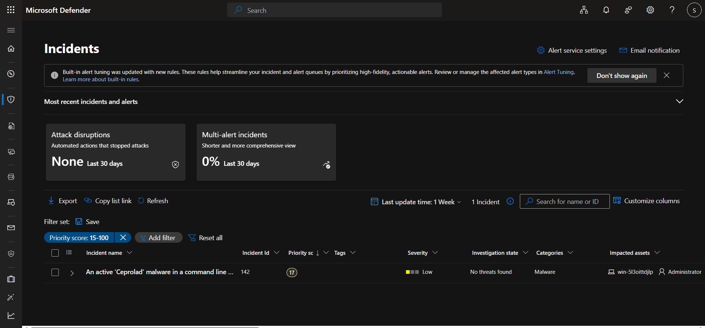
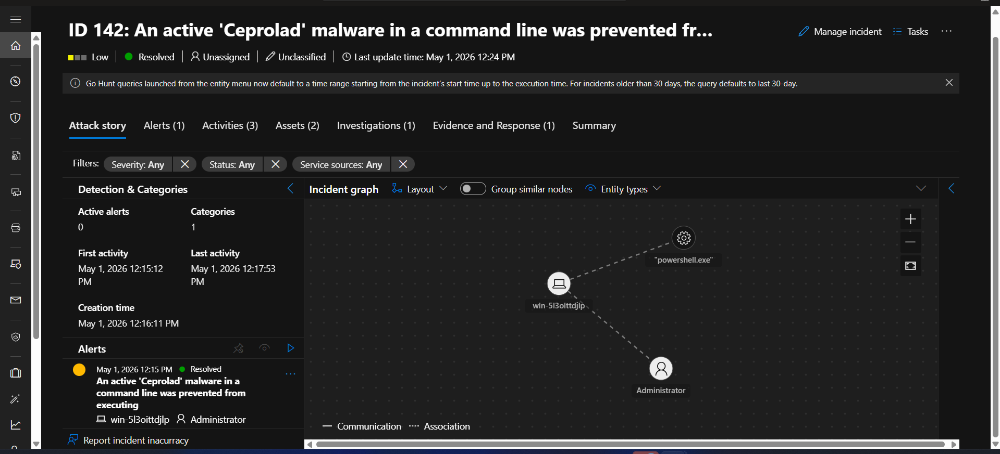
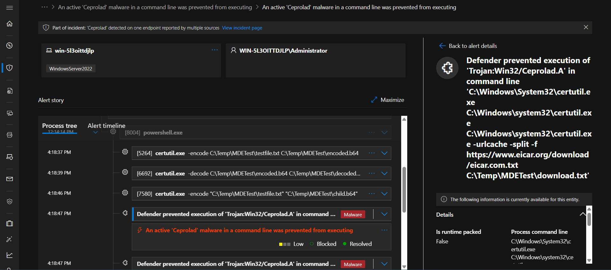
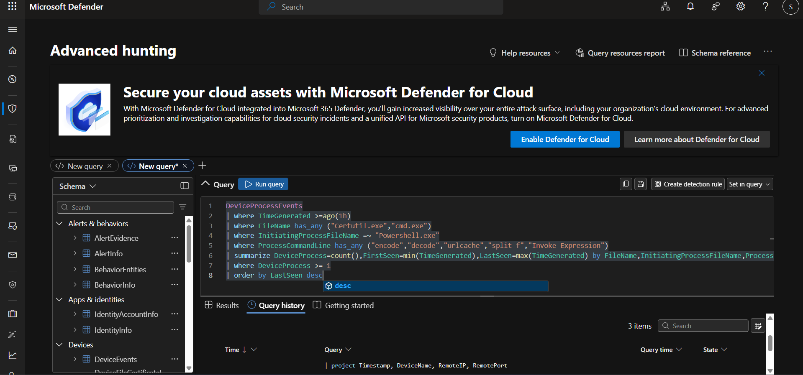
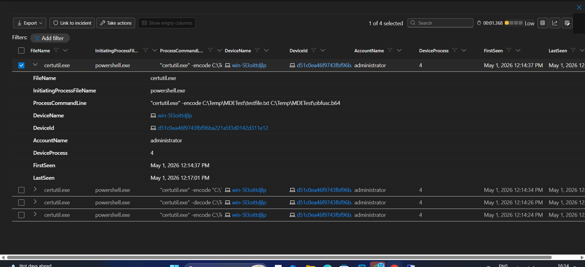
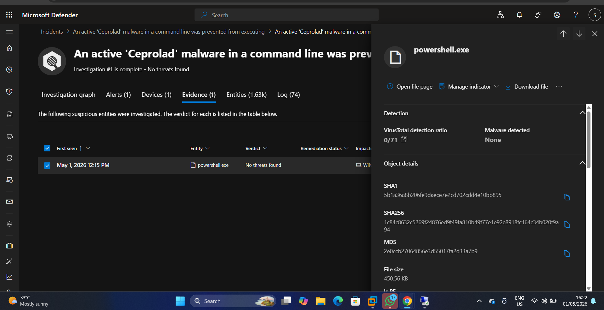
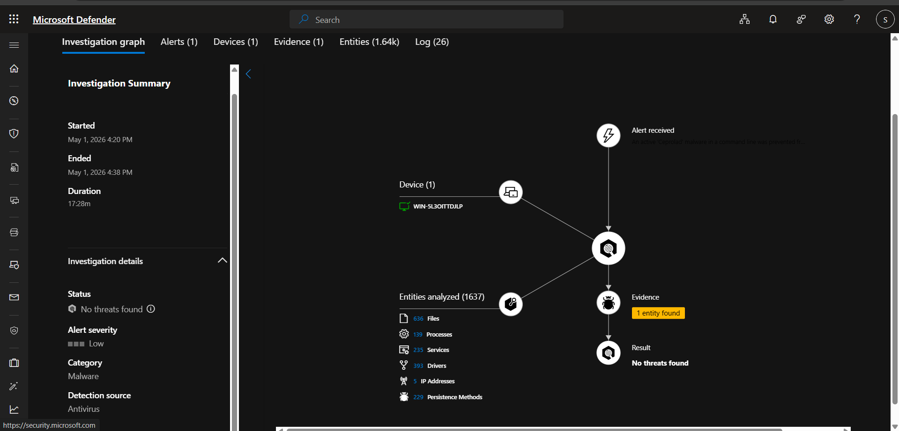
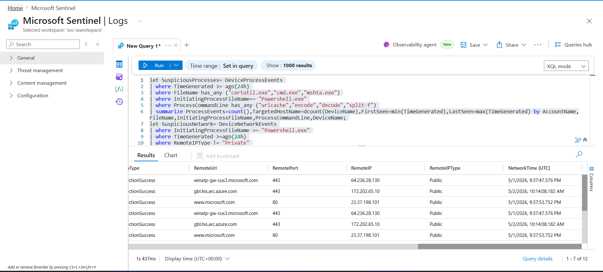

# CertUtil LOLBin — Ceprolad Detection Investigation

## Overview

| Field | Details |
|---|---|
| **Date** | May 1, 2026 |
| **Analyst** | Olatunji Abel |
| **Platform** | Microsoft Defender for Endpoint + Microsoft Sentinel |
| **Device** | win-5l3oittdjlp (Windows Server 2022) |
| **User** | WIN-5L3OITTDJLP\Administrator |
| **Alert Name** | An active 'Ceprolad' malware in a command line was prevented from executing |
| **Incident ID** | 142 |
| **Severity** | Low |
| **Status** | Resolved |
| **Verdict** | True Positive (benign) — Authorized Security Simulation |

---

## MITRE ATT&CK Mapping

| Tactic | Technique | ID | Description |
|---|---|---|---|
| Defense Evasion | Deobfuscate/Decode Files or Information | T1140 | certutil used to encode and decode files to disguise contents |
| Command and Control | Ingress Tool Transfer | T1105 | certutil -urlcache used to download files from the internet |
| Defense Evasion | System Binary Proxy Execution | T1218 | certutil abused as a trusted Windows binary to bypass defenses |
| Execution | Command and Scripting Interpreter: PowerShell | T1059.001 | PowerShell used to spawn certutil and execute commands |

---

## Simulation Script

> **Note:** This simulation script was provided as part of a guided SOC lab exercise. It was not written by me — I used it to generate realistic alerts in MDE and Sentinel for the purpose of practising investigation and threat hunting skills.

```powershell
# ============================================
# CertUtil LOLBin Detection Simulation
# Purpose: Generate MDE/XDR alerts for SOC
# investigation practice
# ============================================

# Setup — create test directory and file
New-Item -ItemType Directory -Path "C:\Temp\MDETest" -Force
"MDE Simulation Test - $(Get-Date)" | Out-File "C:\Temp\MDETest\testfile.txt"

# Simulation 1 — Encode file
# Mimics attacker encoding sensitive data before exfiltration
certutil -encode "C:\Temp\MDETest\testfile.txt" "C:\Temp\MDETest\encoded.b64"
Start-Sleep -Seconds 2

# Simulation 2 — Decode file
# Mimics attacker decoding a received encoded payload
certutil -decode "C:\Temp\MDETest\encoded.b64" "C:\Temp\MDETest\decoded.txt"
Start-Sleep -Seconds 2

# Simulation 3 — Download via urlcache (LOLBin)
# Mimics attacker using certutil as a downloader
certutil -urlcache -split -f "https://www.eicar.org/download/eicar.com.txt" "C:\Temp\MDETest\download.txt"
Start-Sleep -Seconds 3

# Simulation 4 — PowerShell spawning certutil as child process
# Creates suspicious parent-child process chain
Start-Process "certutil.exe" -ArgumentList '-encode "C:\Temp\MDETest\testfile.txt" "C:\Temp\MDETest\child.b64"' -Wait -NoNewWindow
Start-Sleep -Seconds 2

# Simulation 5 — Obfuscated invocation via Invoke-Expression
# Mimics attacker hiding certutil inside a variable
$cmd = 'certutil -encode "C:\Temp\MDETest\testfile.txt" "C:\Temp\MDETest\obfusc.b64"'
Invoke-Expression $cmd

# Cleanup — run when done testing
# Remove-Item -Path "C:\Temp\MDETest" -Recurse -Force
# certutil -urlcache -split -f "https://www.eicar.org/download/eicar.com.txt" delete
```

---

## Incident Overview

On the first of May 2026, an alert showed up in Microsoft Defender as **"An active 'Ceprolad' malware in a command line was prevented from executing"** on the device **win-5l3oittdjlp**.

- First activity was on May 1, 2026 at 4:19:31
- Last activity was at 4:20:30

MDE categorized it as a malware attack. The detection source was Antivirus and the service source was MDE.

The incident graph showed PowerShell executing on the device under the Assets section by the Administrator account.




---

## Investigation

For further investigation I needed to check what process was run and executed, so I went on to click on the Alert Story.

### Process Tree

The process tree showed powershell.exe and certutil.exe encoding a **testfile.txt** using the **encoded.b64** command.

MDE showed what was encoded directly in the Alert Story, which told me it was just **testfile.txt**. It also showed **Administrator** as the user.

In the Alert Story I saw that certutil.exe tried downloading a file using urlcache. MDE blocked this immediately.



---

### How It Was Detected

MDE made this decision based on behavioral analysis. This means certutil trying to download using urlcache from PowerShell exhibited the same behaviour as a known malware called Ceprolad, so it was therefore flagged.

This behaviour of encoding files using PowerShell and certutil is a **LOLBin attack**. Even though the encoded file was just a test file and was run as a lab simulation, MDE sees this as a threat and correlates this behaviour with a malware called Ceprolad. MDE automatically blocked it.




---

### Evidence

MDE Evidence shows that no threats were found. The only entity found was PowerShell.

| Field | Value |
|---|---|
| **Entity** | powershell.exe |
| **Verdict** | No threats found |
| **VirusTotal** | 0/71 — No malware detected |
| **File Size** | 450.56 KB |
| **SHA1** | 5b1a36a8b206fe9daece7e2cd702cdd4e10bb895 |
| **SHA256** | 1c84c8632c5269f24876ed9f49fa810b49f77e1e92e8918fc164c34b020f9a94 |
| **MD5** | 2e0ccb27064856e3d55017fa2d33a7b9 |



---

### MDE Automatic Investigation

The investigation graph showed the entities that were analyzed:

| Entity Type | Count |
|---|---|
| Files | 636 |
| Processes | 139 |
| Services | 235 |
| Drivers | 393 |
| IP Addresses | 5 |
| Persistence Methods | 229 |

The result was **no threats found**.



---

### Network Analysis — Microsoft Sentinel

To conclude the investigation I wrote a KQL query in Sentinel to check for outbound connections. I saw all outbound connections at that timeframe only went to Microsoft, which shows MDE reporting telemetry on the endpoints.

| RemoteUrl | RemoteIP | Port | ActionType |
|---|---|---|---|
| winatp-gw-cus3.microsoft.com | 64.236.28.130 | 443 | ConnectionSuccess |
| gbl.his.arc.azure.com | 172.202.65.10 | 443 | ConnectionSuccess |
| www.microsoft.com | 23.37.198.101 | 80 | ConnectionSuccess |

```kql
let SuspiciousProcesses = DeviceProcessEvents
| where TimeGenerated >= ago(24h)
| where FileName has_any ("certutil.exe","cmd.exe","mshta.exe")
| where InitiatingProcessFileName =~ "Powershell.exe"
| where ProcessCommandLine has_any ("urlcache","encode","decode","split-f")
| summarize
    ProcessEvents = count(),
    TargetedHostName = dcount(DeviceName),
    FirstSeen = min(TimeGenerated),
    LastSeen = max(TimeGenerated)
    by AccountName, FileName, InitiatingProcessFileName, ProcessCommandLine, DeviceName;
let SuspiciousNetwork = DeviceNetworkEvents
| where TimeGenerated >= ago(24h)
| where InitiatingProcessFileName =~ "Powershell.exe"
| where RemoteIPType != "Private"
| project DeviceName, ActionType, RemoteUrl, RemotePort, RemoteIP, RemoteIPType, NetworkTime=TimeGenerated;
SuspiciousProcesses
| join kind=leftouter SuspiciousNetwork on DeviceName
| order by LastSeen desc
```



---

## Conclusion

The alert is a True Positive (benign) because the encoded command run by certutil was just a test command run by an analyst to practice investigation skills. The encoded file was **testfile.txt**.

The other alert with Ceprolad was also a True Positive (benign) as it was also a test command from the analyst. But indeed it should be flagged by MDE, as that behaviour is very and seriously suspicious.

To conclude the investigation, I wrote a KQL query in Sentinel to check for outbound connections. I saw that all outbound connections at that timeframe was only to Microsoft, which shows MDE reporting telemetry about the endpoints. No outbound connections to non-Microsoft or suspicious external infrastructure were observed during the timeframe, and the expected certutil download  was blocked by MDE before completion.

---

## Screenshots

| # | File | Description |
|---|---|---|
| 1 | MDE-Advanced-Hunting.png | Initial KQL hunting query in MDE |
| 2 | MDE-Advanced-Hunting-Results.png | Certutil process events — expanded view |
| 3 | MDE-Incident-Queue-Ceprolad.png | Incident queue showing Ceprolad alert |
| 4 | MDE-Incident-Attack-Story-Graph.png | Incident graph — powershell → Administrator |
| 5 | MDE-Evidence-Powershell-Virus-Total.png | Evidence tab — 0/71 VirusTotal |
| 6 | MDE-Investigation-Graph-No threats.png | Automated investigation — 1637 entities |
| 7 | MDE-Alert-TimeLine-Ceprolad-Blocked.png | Alert timeline — urlcache blocked |
| 8 | Sentinel-Networkconnection-Microsoft-only.png | Network analysis — Microsoft only |

---

*This lab was conducted as part of SOC analyst skills development and detection validation practice.*
