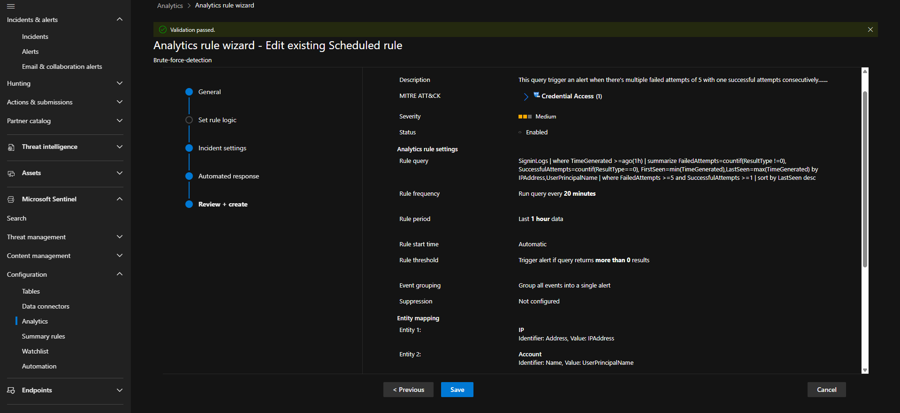
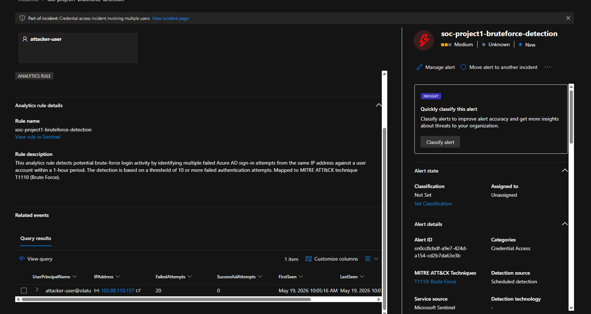
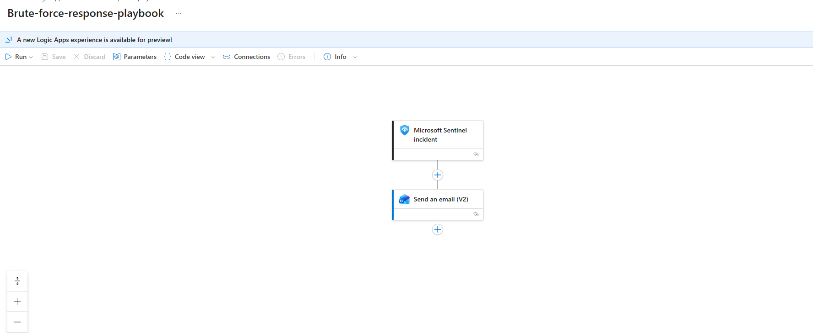
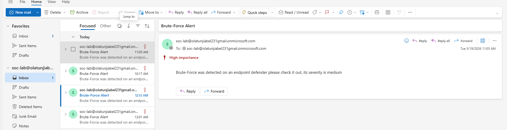

# 🛡️ Microsoft Sentinel SOAR Project — Brute Force Detection

## Project Overview

The main aim of this project is to design an automated response pipeline capable of automatically responding to alerts and incidents inside a SOC environment using Microsoft Sentinel and SOAR technologies.

This project demonstrates how some incidents can be handled automatically without requiring constant manual intervention from a SOC analyst.

In this lab, Microsoft Sentinel was configured to detect potential brute-force authentication activity using Analytics Rules and KQL queries. Once suspicious activity is detected, an incident is automatically created and a Logic App playbook executes an automated response workflow.

The SOC analyst is then able to review the incident, investigate what happened, and validate the automated actions that were triggered inside the Defender portal.

SOAR (Security Orchestration, Automation, and Response) refers to the automated activities and workflows put in place to respond to alerts and incidents more efficiently.

This project shows how SOAR can:
- Reduce analyst workload
- Improve response time
- Automate repetitive response tasks
- Improve visibility into authentication attacks

---

## Prerequisites

- Microsoft Azure Subscription
- Microsoft Sentinel Workspace deployed
- Microsoft 365 Business Standard or E5 License (required for Logic App Outlook connector)
- Microsoft Defender for Office 365
- Log Analytics Workspace with SigninLogs enabled
- Role Assignment: **Sentinel Automation Contributor** assigned to **Azure Security Insights** via IAM

---

## Technologies Used

- **Microsoft Sentinel**
- **KQL** (Kusto Query Language)
- **Analytic Rule**
- **Automation Rule**
- **Logic App / Playbook**
- **Defender for Office 365 / Office 365 E5 License**
- **Role Assignment via IAM** - Sentinel Automation Contributor assigned to Azure Security Insights

---

## MITRE ATT&CK Mapping

| Tactic | Technique | ID |
|---|---|---|
| Credential Access | Brute Force | T1110 |

---

## What I Built

Firstly, my aim is to detect brute-force automatically and respond automatically.

This involved me using Microsoft Sentinel and SOAR.

I wrote a KQL to detect and an Analytics Rule was configured to alert or create an incident in Defender portal.

After that, I went to Logic Apps and created a playbook to alert my Outlook mail anytime an incident like the brute-force attack happens.

Then while I was trying to add the playbook to my Analytics Rule in Automation, I could not click on the brute-force-response playbook I created.

It took me a while to figure out I had to assign the role of Sentinel Automation Contributor to Azure Security Insights in IAM.

Once I assigned the role successfully, the playbook was integrated properly and the SOAR workflow started working.



**KQL Query Logic:**

```kql
SigninLogs
| where TimeGenerated >= ago(1h)
| summarize 
    FailedAttempts = countif(ResultType != 0),
    SuccessfulAttempts = countif(ResultType == 0),
    FirstSeen = min(TimeGenerated),
    LastSeen = max(TimeGenerated)
    by IPAddress, UserPrincipalName
| where FailedAttempts >= 5 and SuccessfulAttempts >= 1
| sort by LastSeen desc
```

The KQL is set to automatically create an incident in Defender portal when there's 5 failed attempts or greater and successful attempts is greater than or equal to 1.


---

### 2. Automation Rule

The Playbook was assigned/integrated to that Analytic rule via the Automation Tab in Sentinel.


---

### 3. Incident Generated

After simulating a Brute Force Attack by entering multiple wrong passwords on my Microsoft user account, an incident was generated in Defender.



---

### 4. Logic App / Playbook
I created a Logic App with the following configuration:

**Trigger:** When an incident is created or updated in Microsoft Sentinel
**Condition:** Filter for brute force incidents only
**Actions:** 
- Send email notification to SOC analyst mailbox

The Logic App validates the incident and only triggers for brute force 
incidents, avoiding unnecessary alert fatigue.



---

### 5. Email Alert Configuration

The Send an email (V2) action was configured to notify the SOC analyst mailbox with High importance whenever a brute force incident is triggered.


---

### 6. Outlook Alert — It Works! ✅

The SOC analyst receives a Brute-Force Alert email directly on Outlook every time the incident is triggered.



---

## Detection Method — Brute Force Attack Simulation

Using the Brute Force Attack method, I simulated by entering multiple wrong passwords on my Microsoft user account to generate an alert/incident in Defender.

- An Analytics Rule was already created beforehand with the KQL written and set to automatically create an incident in Defender portal when there's **5 failed attempts or greater** AND **successful attempts is greater than or equal to 1**.

---

## SOAR Workflow

```
Brute Force Attempt
      ↓
KQL Query Detection
      ↓
Analytics Rule
      ↓
Incident Creation
      ↓
Automation Rule
      ↓
Logic App Workflow
      ↓
Outlook Alert ✅
```

---

## What I Learned

To enable SOAR and to be able to add automation rules to my Analytic rule, I was prompted to assign the role of Sentinel Automation Contributor to Azure Security Insights in IAM (Identity Access Management).This is a very important step to do in other to carry out SOAR automation function properly.

The license for Defender for Office 365 Plan 2 E5 is needed or Business Premium License to be able to use the Outlook connector in the Logic App. This pushed me to set up a proper Microsoft 365 licensing configuration in my home lab.

The impact of SOAR in real-time business is that SOAR allows for the immediate remediation of threats. From my project, the SOAR alerted the SOC Analyst directly on Outlook account to check out a potential Brute Force Attack. This can reduce the time between incident in defender portal and human awareweness.

---

## Author

**Olatunji Abel**  
SOC Analyst | Home Lab | Microsoft Sentinel 
