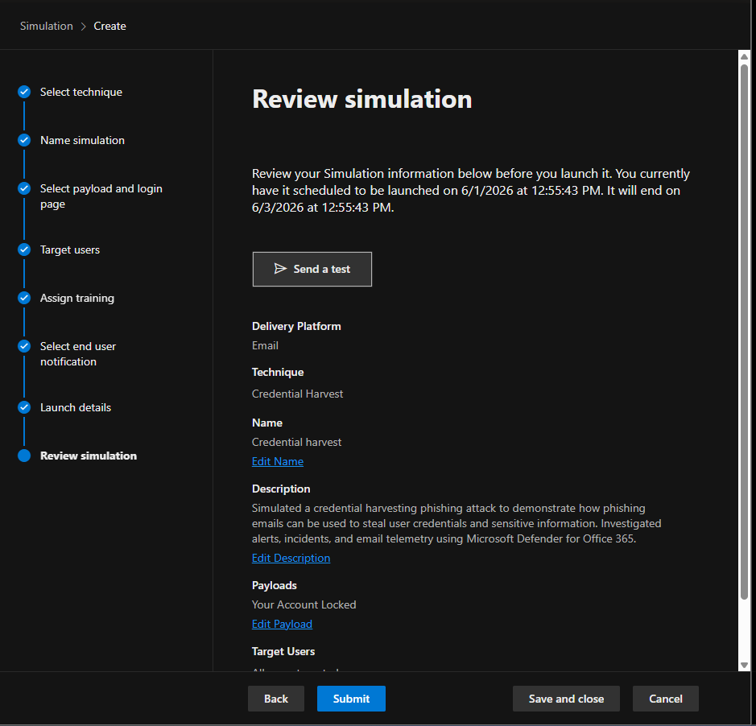
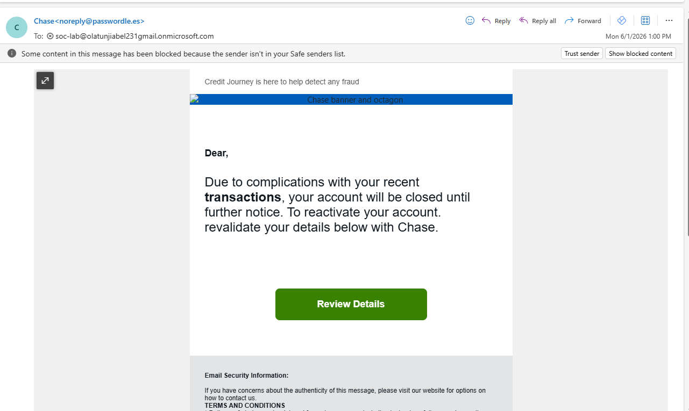
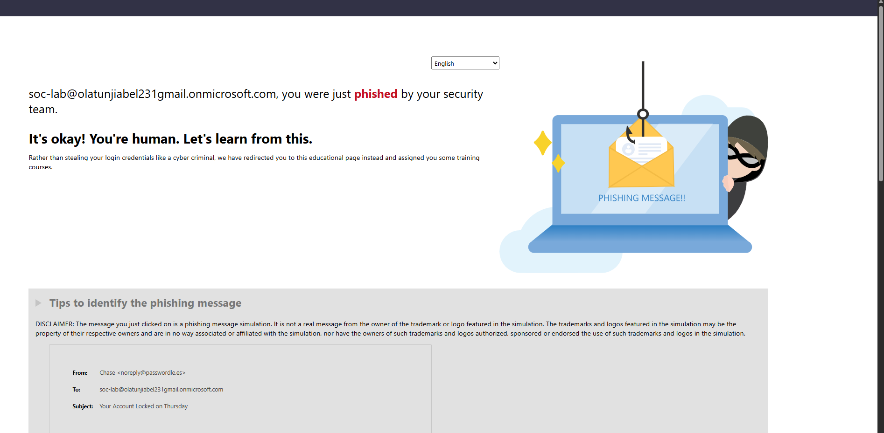
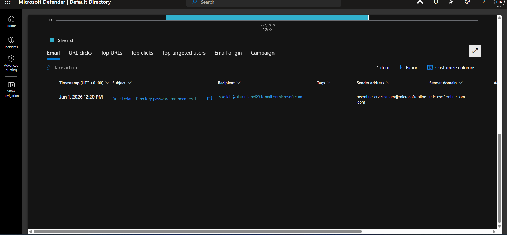
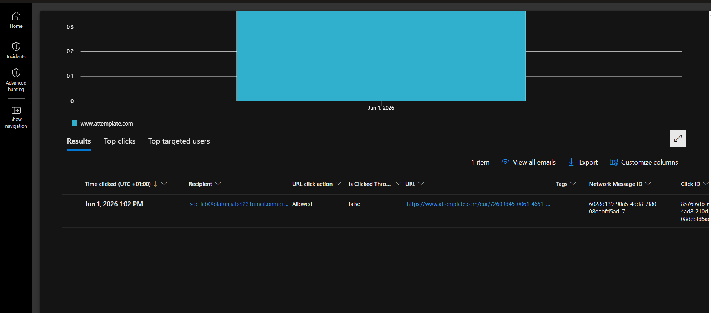
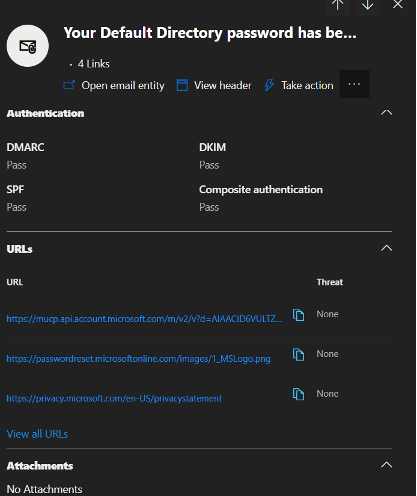
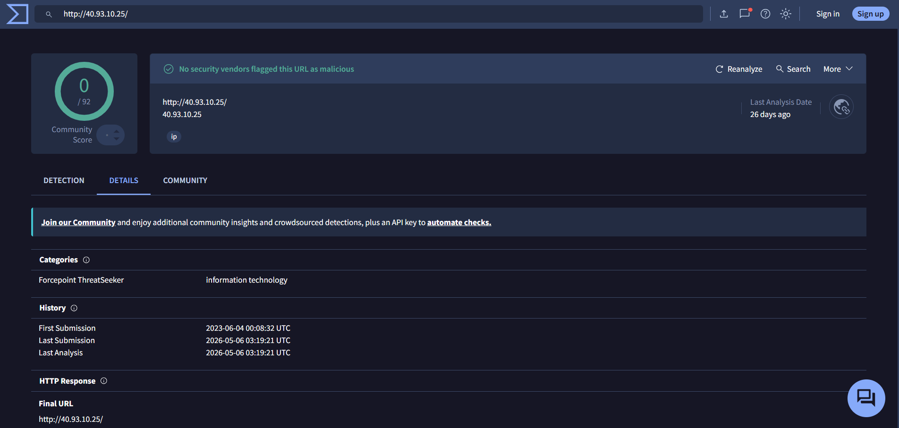

#  Email Phishing Detection & Investigation Using Microsoft Defender for Office 365


---

## Overview

This lab work aims at describing the end-to-end workflow involved in investigating a suspected or compromised email message.

Using Microsoft Defender for Office 365 Plan 2, I simulated and investigated a credential harvesting phishing attack to understand how phishing emails are delivered, how users interact with them, and how SOC analysts investigate email-based threats.

---

## Objective

To simulate a credential harvesting attack using a phishing email.

I opened the Microsoft Defender Portal, clicked on **Email and Collaboration**, then clicked on **Attack Simulation Training**. From there, I configured what I wanted my phishing email to contain.

In my simulation email, the message was:

> "Your Account Has Been Locked"

to trick the user into clicking the link and entering their email address and password.

I added the user I wanted the email to be sent to, and it was successfully delivered.



---

## Investigation

On receiving the email, the user clicked the **Review Details** link and entered the requested credentials.



After entering the credentials, the following message was displayed:

> "You were just phished by your security."



To investigate the email, I opened **Threat Explorer** from the Email & Collaboration section of the Microsoft Defender Portal.

The following information was reviewed:

| Field | Value |
|---------|---------|
| Sender IP Address | 40.93.10.25 |
| Sender Mail From Address | msonlineserviceteam@microsoftonline.com |
| Sender Location | United States |
| Recipient Email | soc-lab@olatunjiabel231gmail.onmicrosoft.com |
| Time Received | June 1, 2026 — 1:20 PM |



I reviewed the sender IP address and the URLs contained within the email.

If AIR had been triggered, additional investigation information may have been available within Microsoft Defender to assist the investigation process.

I also reviewed the sender IP address because IP reputation helps analysts determine whether an IP address is a known malicious source or has been involved in previous malicious activity.

Outside Microsoft Defender, IP address reputation can be verified using threat intelligence sources such as VirusTotal.

In this case, the sender IP address belonged to Microsoft infrastructure because the email originated from Microsoft Attack Simulation Training.


The email contained **3 URLs**, but no threats were identified because the email was part of an authorized phishing simulation.



---

## Email Authentication Analysis

| Protocol | Result |
|----------|--------|
| DMARC |  Pass |
| DKIM |  Pass |
| SPF |  Pass |



### What Each Result Means

- **SPF** – The sender IP address was authorized to send email on behalf of the sending domain.
- **DMARC** – The sending domain aligned with the authentication results.
- **DKIM** – The email was digitally signed by the sending domain.
- **Attachments** – None.

###  Analyst Observation

As a SOC Analyst, emails passing SPF, DKIM, and DMARC do not automatically guarantee legitimacy.

An adversary can open a Gmail account and use it to send a phishing email.

The email will pass **SPF** because it is a legitimate email account on Google's domain.

It will pass **DMARC** because the email is genuinely being sent from the sender's domain and aligns with the authentication checks.

It will also pass **DKIM** because Gmail digitally signs outgoing emails on behalf of its domain.

This demonstrates that SPF, DKIM, and DMARC only verify the legitimacy of the sending infrastructure. They do not determine whether the content or intent of the email is malicious.

This is why user awareness training and additional security controls are still required even when email authentication checks pass successfully.


---

## Microsoft Defender for Office 365 Capabilities Observed

During the investigation, I reviewed several Microsoft Defender for Office 365 security capabilities that help detect, investigate, and respond to email-based threats.

| Feature | Description |
|---------|-------------|
| Safe Links | Detects malicious URLs and protects users from phishing links |
| Safe Attachments | Performs sandbox analysis of email attachments |
| AIR | Automated Investigation and Response |
| Investigation & Response | Allows URLs and emails to be submitted for investigation |
| VirusTotal | Used to validate IP reputation |

## External Threat Intelligence Validation

As part of the investigation, I reviewed the sender IP address (40.93.10.25) using VirusTotal.

The VirusTotal results showed that no security vendors flagged the IP address as malicious. This was expected because the email originated from Microsoft Attack Simulation Training infrastructure rather than a real phishing campaign.

This step demonstrates how SOC analysts can use external threat intelligence platforms to validate IP reputation and gather additional context during email investigations.


---

## SOC Analyst Response Playbook

In a real SOC environment, immediately after identifying and validating a phishing attack, the following actions would be taken.

### Credential Theft Response

- Verify whether the compromised credentials are still active
- Reset the user's password immediately
- Enable Multi-Factor Authentication (MFA)

### Containment & Investigation

- Block the sender's email address
- Block the sender's IP address
- Notify the security team
- Use EDR tools to investigate possible endpoint compromise
- Use Microsoft Sentinel to investigate the blast radius and identify additional affected users

### Automated Response

Microsoft Defender for Office 365 Plan 2 includes **Automated Investigation and Response (AIR)** capabilities that can automatically investigate and remediate malicious emails, URLs, and user-reported threats.

AIR was not triggered during this simulation because the phishing email did not generate any alerts or incidents in Microsoft Defender. Since the phishing campaign was created using Microsoft's **Attack Simulation Training**, the email was part of an authorized simulation and was therefore treated differently from a real phishing attack.

As a result, no automated remediation actions were observed during this exercise. In a real phishing incident, AIR could help contain the threat, investigate affected users, and reduce the overall blast radius of the attack.

### Proactive Investigation

- Use Microsoft Defender for Office 365 Plan 2 to proactively hunt for similar phishing activity across the tenant

---

## Key Takeaways

- SPF, DKIM, and DMARC passing does not mean an email is safe
- An attacker using a legitimate account can still pass authentication checks
- Threat Explorer provides visibility into sender information, recipients, delivery status, URLs, and click activity
- User click activity can be tracked and investigated in Microsoft Defender
- Human behaviour remains one of the biggest risks in phishing attacks
- Layered security controls, user awareness training, and incident response procedures are essential

---


## Lessons Learned

This project showed me that emails passing SPF, DKIM, and DMARC do not automatically mean they are safe.

The user Credential was still harvested even though all authentication checks passed.

I also learned how to use Threat Explorer to investigate phishing emails, review URLs, check sender information, and analyze user activity.

I observed that Microsoft Attack Simulation Training did not generate any alerts or incidents. I was expecting to see Automated Investigation and Response (AIR) in action, but because the phishing email was part of an authorized Microsoft simulation, it did not trigger the same response as a real phishing attack.

This also helped me understand that advanced hunting and Microsoft Sentinel may be required for deeper investigations and cross-correlation when investigating real-world phishing activity.

This project reinforced the importance of user awareness training and layered email security controls.


---

## Conclusion

In this project, I simulated a credential harvesting phishing attack and investigated it using Microsoft Defender for Office 365.

I reviewed the sender information, URLs, user click activity, and authentication results.

The investigation showed that phishing emails can still be successful even when SPF, DKIM, and DMARC pass.

This project helped me gain hands-on experience with email phishing detection and investigation from a SOC analyst perspective.

---

## Project Structure

```text
project-7-phishing-investigation/
├── README.md
└── screenshots/
    ├── Attack-simulation-review.png
    ├── Phishing-email-received.png
    ├── User-phished-confirmation.png
    ├── Threat-explorer-email-view.png
    ├── Url-click-investigation.png
    └── Authentication-results.png
```
