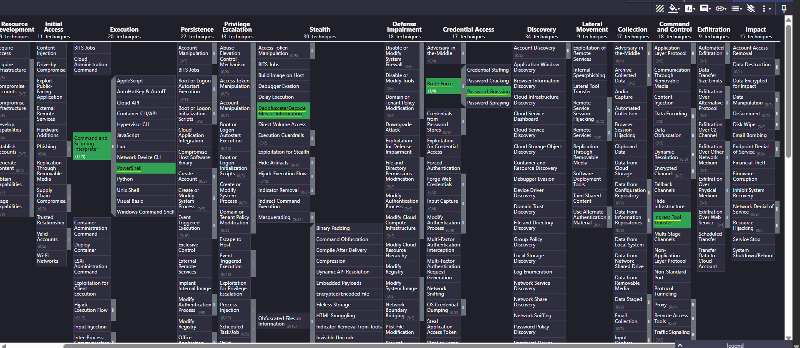

# Project 9: Adversary TTP Mapping with MITRE ATT&CK
## Detection Engineering Project

## Introduction

In this project I demonstrate how I map adversary tactics and 
techniques to the MITRE ATT&CK framework as part of my detection 
engineering workflow. This is not just about labeling techniques — 
it is about showing the analytical reasoning behind how I arrive 
at each mapping and how that mapping drives the detection strategy 
I build.

As a SOC Analyst, understanding MITRE ATT&CK is critical because:

- It gives you a standard language to describe adversary behavior
- It helps you identify what tactics and techniques are being used 
  against your environment
- It guides you in building better detection rules and queries
- It helps you identify gaps in your detection coverage

The findings in this project are drawn from real alerts and 
investigations conducted in my Azure lab environment using 
Microsoft Sentinel, Microsoft Defender for Endpoint, and 
Azure AD. For each finding I document my observation, my analyst 
reasoning, how I navigated MITRE ATT&CK to arrive at the correct 
tactic and technique, and the detection rule I built from that 
mapping.

---

## Finding 1: Multiple Failed Login Attempts Against a User 
Account (Azure AD)

### Observation
In this detection engineering project, during my incident 
investigation, an alert was presented showing multiple failed 
login attempts against a user account from a particular IP 
address in my Azure environment.

### Analyst Observation
My observation from this alert is that the adversary is trying 
to gain access by trying multiple passwords on that particular 
user account. Their aim is to eventually figure out the correct 
credentials to authenticate successfully.

### ATT&CK Mapping
To map this behavior to ATT&CK, I navigated to attack.mitre.org 
and opened the Enterprise Matrix. My initial thought was that 
the adversary was attempting Initial Access since they were 
trying to get into the environment. However, when I navigated 
to ATT&CK I realized the distinction — Initial Access covers 
how an attacker first enters an environment, while Credential 
Access covers how they obtain credentials to authenticate.

Since the adversary was trying to guess the correct password 
on a user account by trying multiple times, I looked under the 
Credential Access tactic. Scanning through the techniques, I 
identified T1110 – Brute Force as the match because the alert 
showed repeated failed login attempts against a single account 
from one IP address.

Reading through the sub-techniques, T1110.001 – Password 
Guessing was the most accurate fit since the attempts were 
focused on one specific account rather than spraying across 
multiple accounts.

- **Tactic:** Credential Access
- **Technique:** T1110 – Brute Force
- **Sub-technique:** T1110.001 – Password Guessing
- **Data Source:** Azure AD Sign-in Logs

### Detection Strategy
Mapping this behavior to T1110.001 told me exactly what to 
build a detection rule around. As a SOC analyst, I developed 
my detection strategy based on the following indicators:

- Monitor for failed authentication attempts using 
  **ResultType != 0** in Azure AD Sign-in Logs — any non-zero 
  result type indicates a failed login
- Apply a threshold of **more than 5 failed attempts** from 
  the same IP against the same account to confirm this is 
  not random noise
- Look for **same IP, same UserPrincipalName** correlation 
  to confirm this is a targeted brute force attack

### Detection Rule
```kql
SigninLogs
| where ResultType != 0
| summarize FailedAttempts = count() by UserPrincipalName, IPAddress
| where FailedAttempts > 5
| sort by FailedAttempts desc
```

---

## Finding 2: RDP Brute Force Against a User Account

### Observation
In my RDP brute force investigation, an alert fired showing 
multiple failed RDP login attempts against a user account from 
a single IP address.

### Analyst Observation
The behavior observed here is similar to Finding 1 — the 
adversary is attempting to guess the correct credentials. 
However, in this case the attack is targeting the RDP protocol 
specifically, meaning the attacker's goal is to gain remote 
desktop access to the machine once they obtain the correct 
credentials.

### ATT&CK Mapping
Using the same methodology as Finding 1, I navigated to 
attack.mitre.org and looked under the Credential Access tactic. 
The behavior maps to the same technique — T1110 – Brute Force, 
sub-technique T1110.001 – Password Guessing.

This is an important observation — the same adversary technique 
can manifest across different protocols. Finding 1 targeted 
Azure AD authentication while Finding 2 targets RDP. This means 
a robust detection strategy needs coverage across both data 
sources, not just one.

- **Tactic:** Credential Access
- **Technique:** T1110 – Brute Force
- **Sub-technique:** T1110.001 – Password Guessing
- **Data Source:** Windows Security Event Logs
- **Protocol:** RDP (Remote Desktop Protocol)

### Detection Strategy
For RDP brute force specifically, the detection strategy differs 
from Azure AD. Rather than monitoring Sign-in Logs, I monitor 
Windows Security Event Logs for both failed and successful 
logon events:

- Monitor for **EventID 4625** (failed logon) and **EventID 
  4624** (successful logon) together
- Filter by **Logon Type 3 and 10** — these indicate network 
  and remote interactive logons specific to RDP
- Apply a threshold of **10 or more failed attempts within a 
  30 minute window** from the same IP against the same account
- My query also correlates failed attempts with a subsequent 
  successful logon — this detects the worst case scenario 
  where the adversary successfully guessed the correct 
  password and got in
- Flag any account showing both high failed attempts and a 
  successful logon as critical priority for immediate 
  investigation

### Detection Rule
```kql
SecurityEvent
| where TimeGenerated >= ago(30m)
| where EventID in (4624, 4625)
| where LogonType in (3, 10)
| extend Account = tolower(Account)
| summarize 
    FailedAttempts = countif(EventID == 4625),
    SuccessfulAttempts = countif(EventID == 4624 
        and LogonType == 10)
    by Account, IpAddress, bin(TimeGenerated, 30m)
| where FailedAttempts >= 10 and SuccessfulAttempts >= 1
| sort by FailedAttempts desc
```

---

## Finding 3: LOLBin Abuse — PowerShell Spawning Certutil
(Ceprolad Malware Detection)

### Observation
In my Project 5 LOLBin Process Detection investigation, an 
alert triggered and showed an active "Ceprolad" malware in a 
commandline was prevented from executing. In the investigation 
it showed PowerShell.exe using certutil.exe to run an encoded 
command. It also showed certutil.exe trying to download a file 
using URL Cache.

### Analyst Observation
My observation from this alert is that the adversary used a 
Living off the Land Binary (LOLBin) to create a process on 
the machine. Living off the Land Binaries are legitimate 
Windows binaries that adversaries abuse to avoid detection — 
because these are normal processes that blend in with regular 
system activity.

The adversary used PowerShell to spawn certutil and run encoded 
commands. Certutil was also observed trying to download a file 
externally using URLcache. This tells me the adversary was 
trying to both evade detection and establish communication with 
an external source to pull down a payload.

### ATT&CK Mapping
To map this behavior I navigated to attack.mitre.org and 
identified three techniques across different tactics based on 
what I observed:

**1. T1059.001 – Command and Scripting Interpreter: PowerShell**
PowerShell was used as the execution method to spawn certutil 
and run the encoded command. This falls under the Execution 
tactic because the adversary used PowerShell as their scripting 
interpreter to carry out the attack.

**2. T1140 – Deobfuscate/Decode Files or Information**
Certutil was used to run encoded commands. I mapped this to 
Deobfuscate/Decode Files or Information under the Defense 
Evasion tactic because encoding commands is a technique 
adversaries use to hide malicious activity from security tools 
and analysts.

**3. T1105 – Ingress Tool Transfer**
Certutil was observed trying to download a file using URLcache 
— connecting externally to pull down a payload. This maps to 
Ingress Tool Transfer under the Command and Control tactic 
because the adversary was using a legitimate binary to transfer 
malicious tools into the environment from an external source.

| Tactic | Technique ID | Technique Name |
|--------|-------------|----------------|
| Execution | T1059.001 | Command and Scripting Interpreter: PowerShell |
| Defense Evasion | T1140 | Deobfuscate/Decode Files or Information |
| Command and Control | T1105 | Ingress Tool Transfer |

### Detection Strategy
Mapping this behavior to ATT&CK told me exactly what to monitor 
to detect LOLBin abuse in my environment. As a SOC Analyst I 
built a detection rule in Project 5 to catch anomalies like this.

**What to look out for:**
- **EventID 4688** — Process Creation events showing certutil.exe 
  being spawned
- **FileName** — certutil.exe appearing as a child process
- **InitiatingProcessFileName** — PowerShell.exe as the parent 
  process spawning certutil
- **CommandLine** — look for keywords like encode, decode, 
  URLcache in the command line arguments — these are strong 
  indicators of abuse
- **Correlate two event entities** — DeviceProcessEvents and 
  DeviceNetworkEvents to get the full picture

**Checking for C2 activity:**
After identifying the process behavior, I checked 
DeviceNetworkEvents to look for any outbound connections made 
within the same time window. This answers the question — 
"Is this a C2 beacon attack?" By checking for any external IP 
address that certutil was used to connect to, I can determine 
whether the adversary successfully established communication 
with a command and control server.

### Detection Rule
```kql
let SuspiciousProcesses = DeviceProcessEvents
| where TimeGenerated >= ago(24h)
| where FileName =~ "certutil.exe"
| where InitiatingProcessFileName =~ "Powershell.exe"
| where ProcessCommandLine has_any ("urlcache","encode",
  "decode","split")
| project
    DeviceName,
    AccountName,
    ProcessCommandLine,
    ProcessTime = TimeGenerated,
    ProcessId;

let SuspiciousNetwork = DeviceNetworkEvents
| where TimeGenerated >= ago(24h)
| where InitiatingProcessFileName =~ "certutil.exe"
| where RemoteIPType != "Private"
| project
    DeviceName,
    RemoteUrl,
    RemoteIP,
    RemotePort,
    NetworkTime = TimeGenerated,
    InitiatingProcessId;

SuspiciousProcesses
| join kind=leftouter SuspiciousNetwork
    on DeviceName, $left.ProcessId == $right.InitiatingProcessId
| order by ProcessTime desc
```

---

## ATT&CK Navigator Heatmap

The following heatmap shows all techniques mapped across the 
three findings in this project. Green indicates full detection 
coverage with a written KQL detection rule.



[Download Navigator Layer File](./attck-layer.json)

---

## Coverage Summary

| Finding | Tactic | Technique ID | Technique Name | Coverage |
|---------|--------|-------------|----------------|----------|
| Azure AD Brute Force | Credential Access | T1110.001 | Password Guessing | ✅ Detected |
| RDP Brute Force | Credential Access | T1110.001 | Password Guessing | ✅ Detected |
| LOLBin - PowerShell | Execution | T1059.001 | PowerShell | ✅ Detected |
| LOLBin - Certutil Decode | Defense Evasion | T1140 | Deobfuscate/Decode Files | ✅ Detected |
| LOLBin - Certutil Download | Command and Control | T1105 | Ingress Tool Transfer | ✅ Detected |

**Total Techniques Mapped: 5**
**Fully Detected: 5**
**Coverage Gaps: 0**

---

## Conclusion

This project demonstrates how MITRE ATT&CK mapping is a core 
part of detection engineering. By mapping real adversary 
behavior observed in my lab environment to ATT&CK techniques, 
I was able to:

- Identify exactly what the adversary was doing at each stage 
  of the attack
- Build targeted detection rules based on the specific 
  indicators each technique generates
- Correlate across multiple data sources — Azure AD Sign-in 
  Logs, Windows Security Event Logs, DeviceProcessEvents, 
  and DeviceNetworkEvents
- Answer critical SOC questions like "Is this a C2 beacon 
  attack?" using evidence-based analysis

ATT&CK mapping is not just a documentation exercise — it is 
what makes detection engineering precise. Without it, you are 
writing queries based on guesswork. With it, you know exactly 
what to look for and why.
